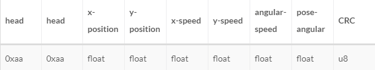

# STM32通过串口与ROS通信
## 概述
机器人移动底座通过串口与ROS主控系统交互通信，ROS主控系统通过发布速度、角速度等信息控制移动底座按既定要求运动；移动底座通过串口实时上传机器人位置、运动角度等信息到ROS主控系统。
### 数据接收
 

移动底座接收ROS主控系统发布过来的运动控制命令，包括线速度、角速度等信息，并附带CRC校验，数据包总长度为15字节。校验算法为将有效数据取异或，即从第三个字节开始取异或。
### 数据上传
移动底座实时上传机器人运动参数，包括位置、速度、角速度、偏航角等信息。


x-position: 机器人实时x坐标位置y-position: 机器人实时y 坐标位置
x-velocity: 机器人 实时x坐标方向速度y-velocity：机器人实时y坐标方向速度
angular velocity: 机器人当前角速度
pose angular: 机器人当前偏航角度
数据上传的总长度为27字节
## 使用
* STM32
将STM32的串口3 与运行ROS系统的串口进行连接 波特率设置为:
```
 115200  8bits 1stop no parity
```
将STM32的串口1连接到电脑的一个串口，进行调试信息的观察，建议使用putty连接 串口模式设置：
```
 9600 8bits 1stop even parity 
```
* ROS 节点
ROS 节点文件名为 my_serial_node ，将源文件解压放置~/catkin_ws/src 目录下，回到 ~/catkin_ws 目录下进行编译，该节点需要使用 serial库 直接clone [serial](https://github.com/wjwwood/serial) 至本地，并与 my_serial_node 放置在同一级目录即可，回到 ~/catkin_ws$ 进行编译:
```
 $catkin_make 
```
之后会生成节点 my_serial_node
## 测试
如果提示串口打不开，需要修改一下串口权限
```
 $sudo chmod a+x /dev/ttyUSB0
```
这里不一定是ttyUSB0 , 使用时修改为自己电脑对应的串口	
测试时开三个terminal,分别运行
```
 $roscore  
 $rosrun my_serial_node my_serial_node
 $rosrun turtlesim turtle_teleop_key
```
此时可以通过键盘方向键发送运动命令，可以在终端窗口观察到信息的发布
如果想查看底层获取的信息可以修改源码添加打印信息，也可以开一个终端，输入一下命令查看：
```
 $rostopic echo /odom 
```
## 备注
本次设计的代码使用键盘模拟发布 cmd_vel 消息，在实际使用时可以用导航功能包代替。移动底座只是手动添加了一些里程计信息，实际使用时可以从移动底座实时获取。
文章链接 [详解stm32串口到底如何与ROS实现信息交互](http://stevenshi.me/2017/10/11/stm32-serial-port-ros/)
